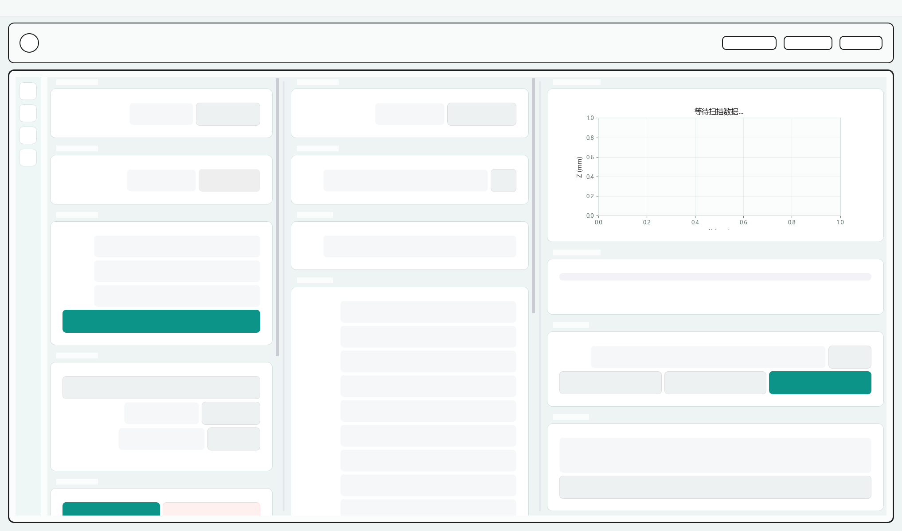

# 光纤 FP 超声成像系统

面向全光纤 Fabry-Perot（FP）超声传感实验的 Windows 桌面应用，将激光器扫描、ITF 斜边工作点选择、Monitor 口稳频锁定、RF 口高速采集和二维位移台扫描整合到一个 PyQt5 界面中。



## 主要功能

- 扫描传感器 ITF 谱线，并从候选峰谷斜边中自动选择高斜率工作点。
- 支持自动工作点、手动目标电压和手动目标波长三种设定方式。
- 使用 PD Monitor 口进行慢速闭环锁定，限制单次调节步长和总波长范围。
- 使用 PD RF 口和阿尔泰 PCIe8526 进行高速超声波形采集。
- 支持 DTR 上升沿/下降沿、触发灵敏度以及 `±1 V`、`±5 V` 输入量程。
- 支持位移台联动二维扫描和纯触发重复采集。
- 纯触发模式采用 FINITE 重复触发、单次启动、预分配内存和限频波形预览。
- 支持扫描数据、触发波形和采集元数据导出。
- 可通过 PyInstaller 打包为 Windows 应用。

## 系统组成

典型实验链路：

```text
可调谐激光器 -> 光纤 FP 传感器 -> 光电探测器
                                  |- Monitor -> 低速采集卡 -> 工作点锁定
                                  `- RF      -> PCIe8526   -> 超声信号采集

MC600 位移台 -> X/Y 扫描 -> B-scan 数据
```

项目当前适配的设备包括：

- TLB-8800 系列可调谐激光器（串口控制）。
- 支持 `artdaq` Python 接口的低速采集卡。
- 阿尔泰 PCIe8526 高速采集卡及 ART-SCOPE SDK。
- MC600 二维位移台控制器。

硬件端口、通道和默认采集参数集中在 `config.py` 中配置。

## 环境要求

- Windows 10/11
- Python 3.11（当前打包环境）
- Python 依赖见 `requirements.txt`
- ART-SCOPE 驱动和 Python SDK
- 低速采集卡驱动及 `artdaq` Python 接口
- 激光器和位移台所需串口驱动

厂家驱动和 SDK 不包含在本仓库中，需要在实验电脑上单独安装。

## 安装与运行

```powershell
git clone <repository-url>
cd ultrasound_imaging

python -m venv .venv
.\.venv\Scripts\Activate.ps1
python -m pip install -r requirements.txt
python main.py
```

也可以双击 `run_main.bat`，它会调用当前环境中的 `python`。

如果 ART-SCOPE SDK 不在默认安装目录，可以在 PowerShell 或系统环境变量中设置：

```powershell
$env:ART_SCOPE_PYTHON_PATH = "D:\path\to\ART-SCOPE\Samples\Python"
python main.py
```

使用支持 `.env` 的 IDE 时，也可以参考 `.env.example` 配置同名变量。

## 基本使用流程

1. 确认激光器、低速采集卡、PCIe8526 和位移台驱动已安装。
2. 在解调区域执行 ITF 扫描，检查谱线是否完整。
3. 自动或手动设定工作点，然后启动锁定。
4. 在扫描区域连接位移台和高速采集卡。
5. 选择位移台联动或纯触发采集模式。
6. 设置输入量程、DTR 边沿、灵敏度、采样率、点数和触发组数。
7. 开始采集并在导出目录检查数据及对应的元数据 JSON。

## 数据说明

- 位移台扫描保存扫描数据和位置数组，主要格式为 NumPy `.npy`。
- 纯触发采集在采集阶段先写入内存，采集卡关闭后再导出每组 `.dat` 波形。
- 元数据记录采样率、点数、量程、触发设置、成功组数和有效采集速率。
- 实验数据、日志、环境变量、打包目录默认由 `.gitignore` 排除，不会提交到 Git。

## 项目结构

```text
main.py                     程序入口
main_window.py              主窗口及面板编排
config.py                   默认硬件与采集参数
fp_lock_pfi_trigger.py      ITF扫描、工作点选择和锁定控制
art_scope_daq.py            PCIe8526 / ART-SCOPE 封装
mc600_controller.py         位移台控制
hardware_paths.py           外部硬件SDK路径发现
widgets/                    解调、扫描和结果界面
workers/                    激光器与采集后台线程
build_windows_app.ps1       Windows打包脚本
PACKAGING.md                打包与实验电脑部署说明
```

## Windows 打包

```powershell
.\build_windows_app.ps1
```

生成的程序位于：

```text
dist\FiberFP_Ultrasound_Imaging\FiberFP_Ultrasound_Imaging.exe
```

详细说明见 [PACKAGING.md](PACKAGING.md)。

## 当前注意事项

- 这是依赖具体实验硬件和厂家驱动的研究软件，提交代码前应在实验电脑完成硬件回归测试。
- 纯触发模式当前保留 FINITE 重复触发，每次触发仍调用一次驱动读取；高重复频率下应核对成功组数和有效采集速率。
- 输入信号超过所选量程会产生削顶，应根据 RF 信号幅值选择 `±1 V` 或 `±5 V`。
- 仓库不包含厂家驱动、DLL、SDK、实验原始数据及个人环境配置。
